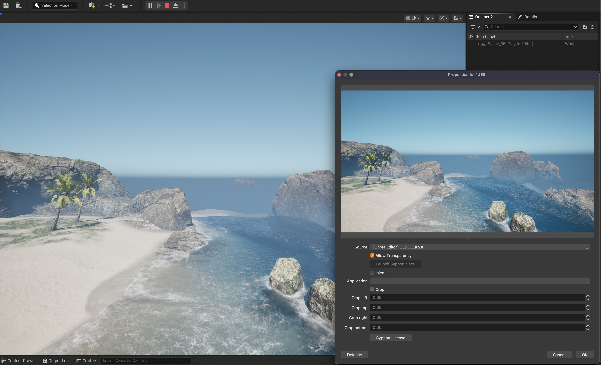
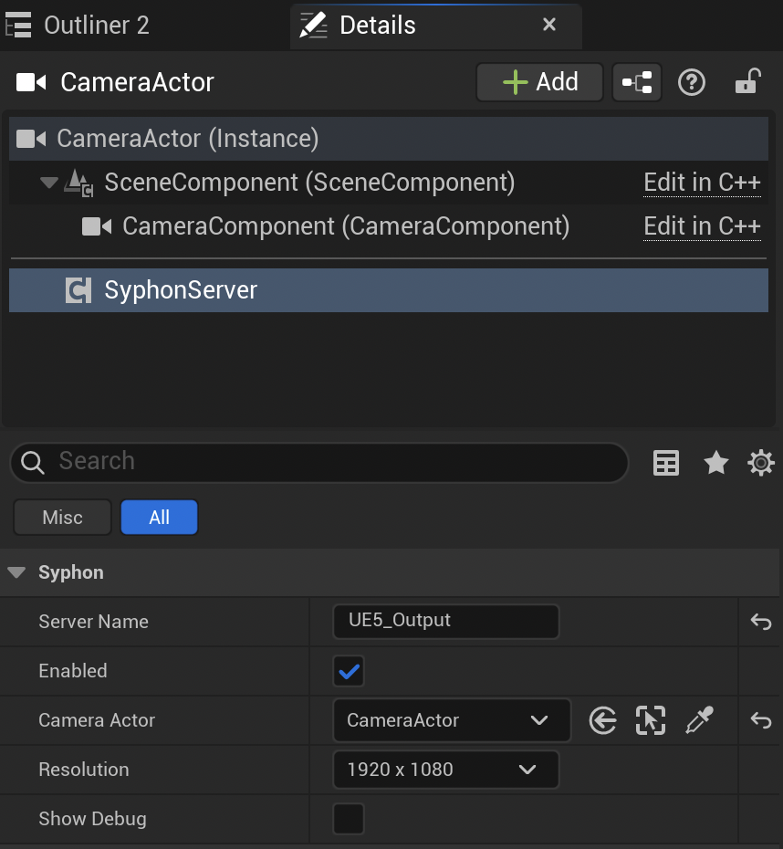

# SyphonLink

**Syphon server plugin for Unreal Engine 5.**

SyphonLink publishes any UE5 camera as a [Syphon](http://syphon.info) source — GPU-direct, zero-copy — so your Unreal scenes appear live in Resolume, MadMapper, OBS, Max/Jitter, or any other Syphon-aware app on the same Mac.

Built for live audiovisual performance: pick a camera, name your server, hit Play.



---

## Features

- **Syphon server component** — drop `SyphonServer` on any actor
- **Camera picker** — publish whichever camera you choose; switch cameras at runtime with the `Set Camera` Blueprint node (built for scene-switching VJ setups)
- **Fixed output resolution** — 720p / 1080p / 1440p / 4K, independent of window size
- **Metal-native** — uses Syphon's Metal API and IOSurface; no readback, no copies
- **Blueprint API** — Start Server, Stop Server, Set Camera, all properties editable live

## Requirements

- macOS on Apple Silicon (tested on M5)
- Unreal Engine 5.7 (other 5.x versions untested)
- Xcode installed (for building the plugin)

## Install

1. Download the latest release zip (or clone this repo)
2. Copy the `SyphonLink` folder into your project's `Plugins/` directory
3. If your project is Blueprint-only, add one empty C++ class first (Tools → New C++ Class → None) so the project can compile plugins
4. Build the editor target from Terminal:

```
"/Users/Shared/Epic Games/UE_5.7/Engine/Build/BatchFiles/Mac/Build.sh" \
  YourProjectEditor Mac Development \
  -project="/path/to/YourProject.uproject"
```

5. Open the project. SyphonLink appears under Edit → Plugins → Rendering.

## Quick start

1. Add an **Empty Actor** to your persistent level
2. **Add Component → Syphon Server**
3. Set **Server Name**, pick a **Camera Actor**, choose a **Resolution**
4. Press **Play**
5. Open Simple Clien (https://github.com/Syphon/Simple) or a tool of your choice




## Runtime camera switching (Blueprint)

For scene-based shows: after loading a new scene/sublevel, find its camera (e.g. by tag) and call **Set Camera** on the SyphonServer component. The output follows instantly.

```
Get All Actors With Tag ("SceneCam") → Get [0] → SyphonServer → Set Camera
```

## Component reference

| Property | Type | Description |
|---|---|---|
| Server Name | String | Name shown in Syphon clients |
| Enabled | Bool | Start/stop publishing |
| Camera Actor | Actor | Camera the output follows (position, rotation, FOV) |
| Resolution | Enum | 1280×720, 1920×1080, 2560×1440, 3840×2160 |

| Function | Description |
|---|---|
| Start Server | Creates the Syphon server and capture pipeline |
| Stop Server | Stops publishing and tears down |
| Set Camera | Retargets the output to another camera at runtime |

## Known limitations (v1.0)

- **One server per app** — the server is a singleton; multiple SyphonServer components will conflict
- **Publishes during Play (PIE) and in packaged builds** — no output while idle in the editor
- **Server only** — receiving Syphon sources *into* UE5 (client) is planned for v2
- Tested on UE 5.7 / Apple Silicon only

## How it works

A `SceneCaptureComponent2D` renders the selected camera into a fixed-size render target. On the render thread, the render target's native Metal texture is handed to a `SyphonMetalServer`, which shares it with other apps via IOSurface. No pixels are copied or downloaded from the GPU.

## Licence

SyphonLink is released under the [MIT licence](LICENSE).

This plugin embeds the [Syphon framework](https://github.com/Syphon/Syphon-Framework), © bangnoise (Tom Butterworth) & vade (Anton Marini), used under its licence — see [LICENSE-Syphon](Source/SyphonLink/ThirdParty/Syphon/LICENSE-Syphon.txt).

## Credits
Built on the [Syphon framework](https://github.com/Syphon/Syphon-Framework)
by bangnoise (Tom Butterworth) & vade (Anton Marini)
Hige thanks to the Syphon community.